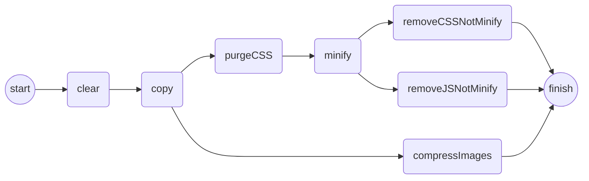

# Projeto gulp-alura
Migração do projeto do treinamento de **Gulp** da Alura para a versão **[4.0.2]**.

## O que foi feito
Migração do projeto para versão 4, utilizando:
- **NodeJS** versão **[14.2.0]**.
- **Yarn** como gerenciador de pacotes versão **[1.22.4]**.

## Ajustes realizados
- Os ajustes foram realizados na construção de ***tasks*** e na forma de executar essas *tasks* de forma **sequencial** e **paralela**;
- Adicionei também uma validação na *task* ***clean*** para poder não gerar erros quando não existir o diretório **dist**;
- Utilizado o *plugin* ***PurgeCss*** que remove CSS não utilizados, isso gerou uma limpeza grande nos *css* que foram gerados, pois ficaram bem reduzidos.
- Adicionado um ***formatter*** para o relatório gerado pelo cssLint;
- Criado as **funções**:
	- ***removeCSSNotMinify***: remove os arquivos ***.css*** não **minificados** do diretório **dist**; 
	- ***removeJSNotMinify***: remove os arquivos ***.js*** não **minificados** do diretório **dist**;
	- ***jsLint***: executa o *jshint* nos arquivos "*.js*";
	- ***cssLint***: executa o *cssLint* nos arquivos "*.css*"
- Criado uma *task* chamada ***lint*** para executar as funções jsLint e cssLint
- Criado os arquivos ***.jsignorelint*** e ***.cssignorelint***, para cadastro de arquivos e/ou pastas a serem ignoradas ao realizar o **lint**;

## Tasks publicadas
Segue as *task* disponibilizadas:

|Task|Descrição|
|---|---|
|**server** |Executa o projeto e sobe em localhost |
|**lint**   |Executar o lint nos arquivos ***js*** e ***css*** do projeto|
|**default**|Executa o processo de build|


### Task Default
Para execução das tarefas em sequencial foi utilizado a função ***series*** e para execução paralela a função ***parallel***.

**Código**:
```javascript
series(clear, copy, parallel(compressImages, series(purgeCSS, minify, parallel(removeCSSNotMinify, removeJSNotMinify))))
```
**Gráfico de execução**:


## Instalação
Após baixar o projeto, executar a instalação dos componentes utilizando yarn:
```
yarn install
``` 

## Referências
Algumas referências utilizadas no processo de desenvolvimento:
|Documentação | Descrição |
|-------------|-----------|
|[GulpJS](https://gulpjs.com/)|Ferramenta de automação do fluxo de trabalho em javascript|
|[NodeJS](https://nodejs.org/en/)|JavaScript Runtime|
|[PurgeCss](https://purgecss.com/)| Plugin para remover CSS não utilizado |
|[Yarn](https://yarnpkg.com/)|Gerenciador de pacotes|